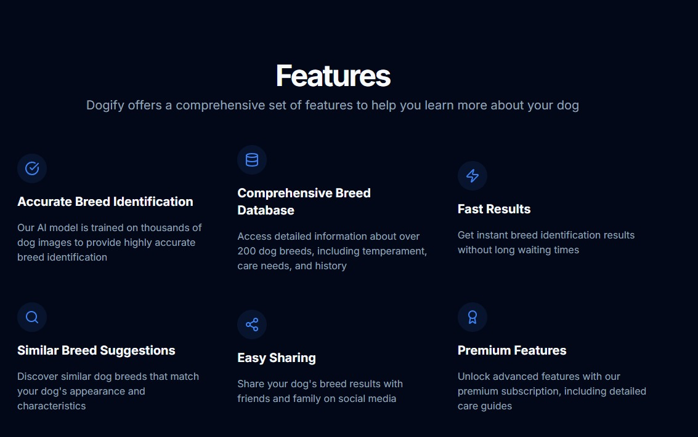
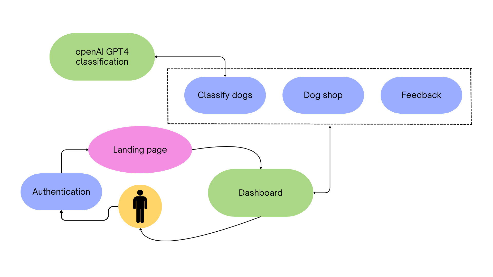

# Dogify

Welcome to **Dofigy** :dog: — a platform that automatically classifies dog breeds using a [state-of-the-art Deep Learning model](https://universe.roboflow.com/cian-zpr5u/dog-breed-xpaq6/model/1), all wrapped in a beautiful, responsive UI and powerful user dashboard.

The following are the features of our service:



---

## Flow

You can checkout the flow diagram here



## Overview

Dofigy aims to provide:
- **Automatic Dog Breed Classification**: Instantly identify a dog’s breed from an uploaded image.
- **Freemium Model**: Basic features for free, with premium features available for advanced usage.
- **Responsive UI**: Access the service from any device with ease.

Whether you’re a casual dog lover wanting to identify a breed or a business seeking quick, accurate breed classification at scale, Dofigy offers a robust solution.

---

## Tech Stack

Dofigy is built on modern, scalable, and user-friendly technologies:

- **Next.js**: A powerful React framework for server-rendered and statically generated apps, ensuring fast performance and SEO-friendly content.
- **Tailwind CSS**: Utility-first CSS framework for building custom, responsive UIs rapidly.
- **Shadcn Components**: Pre-built components that integrate seamlessly with Tailwind, speeding up development and maintaining design consistency.
- **Supabase**: 
  - **Database**: Managed PostgreSQL database for scalable data storage.
  - **User Authentication**: Secure user login/signup, session management, and scalable identity controls.
- **Deep Learning Model**: The dog breed classification is powered by a state-of-the-art model, offering accurate results.

---

## Features

1. **Responsive Dog Breed Classifier**  
   - Upload a dog image to instantly identify the breed.
   - Powered by advanced image recognition with real-time classification results.

2. **User Authentication and Freemium Model**  
   - **Supabase Authentication** ensures secure user registration and login.
   - **Freemium Tier**: Free usage for basic classification and limited daily submissions.
   - **Premium Tier**: Expanded classification limits, additional features, and priority support.

3. **Shopping Marketplace with Dynamic Filters**  
   - Browse and purchase dog-related products, from accessories to dog food.
   - Filter options based on product type, breed-specific items, and pricing.

4. **Scalable Storage and Real-Time Updates**  
   - Images, user submissions, and marketplace data stored in **Supabase** for high availability.
   - Real-time data sync ensures users always see the latest product listings and classification results.

5. **Dashboard for Viewing Submissions**  
   - A comprehensive UI/UX dashboard built using Next.js, Tailwind, and Shadcn components.
   - View recent dog classification submissions, manage your account settings, and track premium usage metrics.

6. **Fast and Easy Deployment**  
   - Single-click deployment on platforms like [Vercel](https://vercel.com/) or your hosting provider of choice.
   - Supabase handles database hosting and authentication seamlessly.

---

## Setup and Installation

1. **Clone the Repository**
   ```bash
   git clone https://github.com/your-username/dofigy.git
   cd dofigy
2. **Install Dependencies**
   ```bash
   npm install
3. **Configure Environment Variables**
   ```bash
   NEXT_PUBLIC_SUPABASE_URL=<your_supabase_project_url>
   NEXT_PUBLIC_SUPABASE_ANON_KEY=<your_public_anon_key>
   SUPABASE_SERVICE_ROLE_KEY=<optional_if_needed_for_serverless_functions>
4. **Run Development Server**
    ```bash
   npm run dev

   
   

